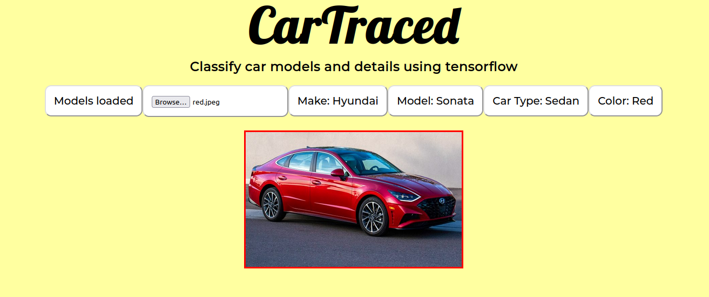

# CarTraced

Car classifier app created using React for the Front end interface and TensorFlow for back end machine learning models. 

## Future Updates / Roadmap for app

- Image preview displaying inside app
- Picture gets analyzed successfully with TF and 
- TF only analyses car pictures. Returns an error message for other pictures
- Load TF models independently
- Add drag and drop for picture upload